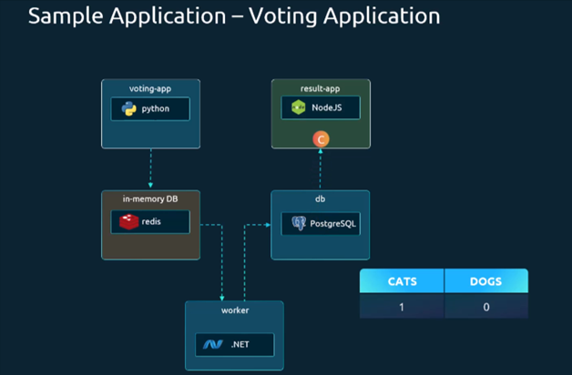

# Voting App - Kubernetes Example

## Architecture Diagram


## Overview
This is a complete voting application example that demonstrates various Kubernetes concepts including Deployments, Services, and Pods. The application consists of multiple microservices that work together to provide a voting system.

## Architecture

The Voting App consists of 5 main components:

1. **Voting App** (`vote`) - Frontend web application for casting votes
2. **Redis** (`redis`) - In-memory data store for temporary vote storage
3. **Worker** (`worker`) - Background service that processes votes
4. **PostgreSQL Database** (`db`) - Persistent storage for vote results
5. **Result App** (`result`) - Frontend web application for viewing results

## Application Flow

```
User → Voting App → Redis → Worker → PostgreSQL → Result App
```

1. Users access the voting app to cast their votes
2. Votes are temporarily stored in Redis
3. Worker service processes votes from Redis and stores them in PostgreSQL
4. Users can view results through the result app

## Components

### 1. Voting App (Frontend)
- **Image**: `dockersamples/examplevotingapp_vote`
- **Port**: 80
- **Purpose**: Web interface for users to cast votes
- **Files**: 
  - `Deployment/voting-deploy.yaml`
  - `Pod/voting-app-pod.yaml`
  - `Service/voting-service.yaml`

### 2. Redis (Cache)
- **Image**: `redis:alpine`
- **Port**: 6379
- **Purpose**: Temporary storage for votes before processing
- **Files**:
  - `Deployment/redis-deploy.yaml`
  - `Pod/redis-pod.yaml`
  - `Service/redis-service.yaml`

### 3. Worker (Background Processor)
- **Image**: `dockersamples/examplevotingapp_worker`
- **Purpose**: Processes votes from Redis and stores them in PostgreSQL
- **Files**:
  - `Deployment/worker-deploy.yaml`
  - `Pod/worker-pod.yaml`

### 4. PostgreSQL Database
- **Image**: `postgres:15-alpine`
- **Port**: 5432
- **Purpose**: Persistent storage for vote results
- **Environment Variables**:
  - `POSTGRES_USER`: postgress
  - `POSTGRES_PASSWORD`: postgress
- **Files**:
  - `Deployment/db-deploy.yaml`
  - `Pod/db-pod.yaml`
  - `Service/db-service.yaml`

### 5. Result App (Results Frontend)
- **Image**: `dockersamples/examplevotingapp_result`
- **Port**: 80
- **Purpose**: Web interface for viewing voting results
- **Files**:
  - `Deployment/result-deploy.yaml`
  - `Pod/result-app-Pod.yaml`
  - `Service/result-service.yaml`

## Directory Structure

```
Voting App/
├── README.md
├── Diagram.png
├── Deployment/
│   ├── voting-deploy.yaml
│   ├── redis-deploy.yaml
│   ├── worker-deploy.yaml
│   ├── db-deploy.yaml
│   ├── result-deploy.yaml
│   ├── voting-service.yaml
│   ├── redis-service.yaml
│   ├── db-service.yaml
│   └── result-service.yaml
├── Pod/
│   ├── voting-app-pod.yaml
│   ├── redis-pod.yaml
│   ├── worker-pod.yaml
│   ├── db-pod.yaml
│   ├── result-app-Pod.yaml
│   ├── voting-service.yaml
│   ├── redis-service.yaml
│   ├── db-service.yaml
│   └── result-service.yaml
└── Service/
    ├── voting-service.yaml
    ├── redis-service.yaml
    ├── db-service.yaml
    └── result-service.yaml
```

## Deployment Instructions

### Option 1: Deploy using Deployments (Recommended)
```bash
# Deploy all components
kubectl apply -f Deployment/

# Check deployment status
kubectl get deployments
kubectl get pods
kubectl get services
```

### Option 2: Deploy using Pods (For learning purposes)
```bash
# Deploy all pods
kubectl apply -f Pod/

# Check pod status
kubectl get pods
kubectl get services
```

## Accessing the Application

1. **Voting Interface**: Access the voting app through the voting service
2. **Results Interface**: Access the results through the result service

### Port Forwarding (for local access)
```bash
# Access voting app
kubectl port-forward service/vote-service 8080:80

# Access result app
kubectl port-forward service/result-service 8081:80
```

Then visit:
- Voting App: http://localhost:8080
- Result App: http://localhost:8081

## Services

All services are of type ClusterIP by default, providing internal communication within the cluster:

- **vote-service**: Exposes the voting application
- **redis-service**: Exposes Redis for vote storage
- **db-service**: Exposes PostgreSQL database
- **result-service**: Exposes the result application

## Scaling

You can scale individual components by modifying the `replicas` field in the deployment YAML files:

```bash
# Scale voting app to 3 replicas
kubectl scale deployment vote --replicas=3

# Scale result app to 2 replicas
kubectl scale deployment result --replicas=2
```

## Monitoring

```bash
# Check pod status
kubectl get pods

# Check service endpoints
kubectl get endpoints

# View logs
kubectl logs deployment/vote
kubectl logs deployment/worker
kubectl logs deployment/result
```

## Cleanup

To remove all resources:
```bash
# If using deployments
kubectl delete -f Deployment/

# If using pods
kubectl delete -f Pod/
```

## Learning Objectives

This example demonstrates:
- **Deployments**: Managing application replicas
- **Services**: Internal communication between components
- **Pods**: Basic pod definitions
- **Microservices Architecture**: Multiple services working together
- **Data Flow**: How data moves between different components
- **Kubernetes Networking**: Service discovery and communication

## Troubleshooting

1. **Pods not starting**: Check pod events with `kubectl describe pod <pod-name>`
2. **Services not accessible**: Verify service endpoints with `kubectl get endpoints`
3. **Database connection issues**: Check if PostgreSQL pod is running and accessible
4. **Vote processing issues**: Check worker pod logs for processing errors

